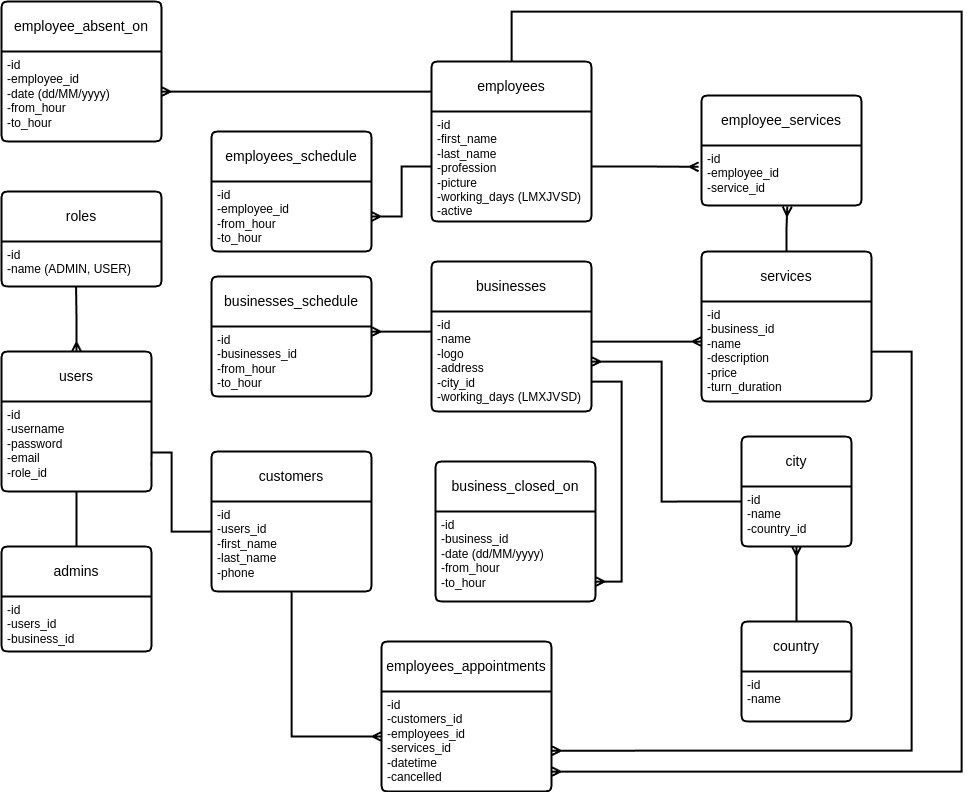

# BookerApp 
<p>Proyecto No Country - Grupo c17-57-t-java</p>


<h2> Introducción</h2>
Aplicación web dedicada a la reserva de turnos de parte de clientes a los distintos comercios que pueden registrarse en la misma.

</br>

- [BookerApp](#bookerapp)
- [Instalación](#instalación)
  - [Base de datos](#base-de-datos)
  - [.env](#env)
  - [Dependencias:](#dependencias)
- [Rutas App Frontend](#rutas-app-frontend)
- [Rutas Servicios](#rutas-servicios)
- [Rutas Profesionales](#rutas-profesionales)
- [Rutas Turnos](#rutas-turnos)
- [Rutas Servicios](#rutas-servicios-1)
- [Rutas Perfil](#rutas-perfil)
- [Rutas peticiones Backend](#rutas-peticiones-backend)
- [Ejemplos de uso](#ejemplos-de-uso)
  - [GET contenidos](#get-contenidos)
  - [GET contenido por ID](#get-contenido-por-id)
  - [POST](#post)
  - [Manejo de errores](#manejo-de-errores)
- [Documentacion de tecnologias utilizadas:](#documentacion-de-tecnologias-utilizadas)


# Instalación

## Base de datos
En MySQL ejecuta el archivo **BookerApp.sql** que se encuentra en la carpeta **config**



## .env
Deberás crear en tu carpeta raíz un archivo de conexion a tu base de datos con nombre **".env"** donde incluirás las siguientes variables con tu informacion local:
```javascript
VITE_API_URL='https://booker-app.singleton-home.tk/BookerApp'
```

## Dependencias:
Asumiendo que tiene node.js preinstalado, asegurese de que su terminal este posicionada en la carpeta raiz del proyecto y ejecute  el siguiente comando para instalar todas las dependencias necesarias:
```
npm install
```

Ahora ya puedes comenzar a ejecutar el programa con el siguiente comando:
```
npm run dev
```
Esto abrira el puerto 5173 de Vite, alli podrias ver todo de manera local.


<br>

# Rutas App Frontend
|URL|DESCRIPCION|
|-|-|
http://localhost:5173/welcome|La URL o ruta principal.
 http://localhost:5173/register| La URL donde podras registrarte.
 http://localhost:5173/login | La URL para poder ingresar con tu username y contrasena.
 http://localhost:5173/home | La URL que veras una vez que ingreses con el user.


<br>

# Rutas Servicios
|MÉTODO|URL|DESCRIPCION|
|-|-|-|
|GET| http://localhost:5173/services | La URL para visualizar servicios disponibles


<br>

# Rutas Profesionales
|URL|DESCRIPCION|
|-|-|
 http://localhost:5173/profesionales| La URL para visualizar profesionales disponibles.


<br>

# Rutas Turnos
|URL|DESCRIPCION|
|-|-|
http://localhost:5173/turnos | La URL para visualizar turnos registrados.


<br>

# Rutas Servicios
|URL|DESCRIPCION|
|-|-|
 http://localhost:5173/services | La URL para visualizar servicios disponibles


<br>

# Rutas Perfil
|MÉTODO|URL|DESCRIPCION|
|-|-|-|
|GET| http://localhost:5173/services | La URL para visualizar toda la informacion del user.


<br>

# Rutas peticiones Backend

|MÉTODO|URL|DESCRIPCION|
|-|-|-|
|POST| VITE_API_URL/customer/register| La URL donde podras registrarte.
|POST| VITE_API_URL/login| La URL para poder ingresar con tu username y contrasena (se debe enviar el ID del business también).
|GET| VITE_API_URL/businesses/{business_id}| La URL para obtener información de un business por su ID.
|GET| VITE_API_URL/businesses| La URL para obtener todos los business registrados en la aplicación.
|GET| VITE_API_URL/services/business/{business_id}?page=0&size=4| La URL para obtener todos los services de un business específico paginado.
|GET| VITE_API_URL/services/{service_id}| La URL para obtener información sobre un service por su ID.
|POST| VITE_API_URL/employees| La URL para crear un employee.
|GET| VITE_API_URL/employees/business/{business_id}?page=0&size=4| La URL para listar employees por business ID paginado.
|GET| VITE_API_URL/employees/{employee_id}| La URL para obtener datos de un employee por su ID.
|GET| VITE_API_URL/customers/{business_id}| La URL para obtener todos los customer de un business por su ID.
|PUT| VITE_API_URL/customer| La URL para editar un customer.
|GET| VITE_API_URL/customer/user/{user_id}| La URL para obtener datos de un customer por su ID de user.
|POST| VITE_API_URL/appointments| La URL donde podras registrar un turno.
|GET| VITE_API_URL/appointments/customer/{customer_id}| La URL para obtener todos los turnos de un customer por su ID.
|GET| VITE_API_URL/appointments/{business_id}?year=2024&month=04| La URL para obtener todos los turnos de un determinado business en un mes y año específico.
|GET| VITE_API_URL/appointments/free_appointments/{employee_id}/service/{service_id}?date=2024-04-23  | La URL para obtener todos los turnos libres de un employee enviando la fecha como query parameter.
|PATCH| VITE_API_URL/appointments/cancel/{appointment_id}| La URL para cancelar un turno por su ID.

# Ejemplos de uso
## GET contenidos
Para realizar las consultas a la API recomendamos utilizar herramientas como postman o thunder client.
Todas las consultas de tipo GET retornarán un formato JSON.

La URL general para visualizar todos empleados de un negocio en particular.
```py
VITE_API_URL/BookerApp/employees/business/2
```

```json
 [
    {
        "id": 2,
        "firstName": "Sergio",
        "lastName": "Rivero",
        "profession": "Barbero",
        "picture": null
    },
    {
        "id": 1,
        "firstName": "Nazareno",
        "lastName": "Bucciarelli",
        "profession": "Peluquero",
        "picture": null
    },
    {
        "id": 3,
        "firstName": "Manuel",
        "lastName": "Martinez",
        "profession": "Peluquero y Barbero",
        "picture": null
    }
]
```

Datos de entrada: business_id (obligatorio)

## GET contenido por ID
La URL  para visualizar  listar servicios por empleado id
```py
VITE_API_URL/employees/services?employee_id=3&business_id=2
```
```json
{
    "id": 3,
    "firstName": "Manuel",
    "lastName": "Martinez",
    "profession": "Peluquero y Barbero",
    "picture": null,
    "services": [
        {
            "id": 1,
            "name": "Corte de barba",
            "description": "Perfila tu barba de una manera elegante",
            "price": 900.0,
            "durationMinutes": 30
        },
        {
            "id": 2,
            "name": "Corte de pelo",
            "description": "Cortes de todos los estilos, desde el más básico hasta el mas complejo",
            "price": 1500.0,
            "durationMinutes": 50
        }
    ],
    "workingDays": "MXJV",
    "active": true
}
```
Datos de entrada: business_id (obligatorio),  Employee id (obligatorio)


## POST
La URL envia la informacion para registrar un nuevo user.
```py
VITE_API_URL/customer/register
```
 Json entrada
```json
{
    "username":"apolo",
    "password":"apolo123",
    "email":"apolop@gmail.com",
    "firstName":"Apolo",
    "lastName":"Pareja",
    "phone":"15985423",
    "roleName":"USER",
    "businessId":1
}
```
Resultado
```json

    {
    "id": 4,
    "user": {
        "id": 5,
        "username": "apolo",
        "password": "apolo123",
        "email": "apolop@gmail.com",
        "role": {
            "id": 2,
            "name": "USER"
        },
        "business": {
            "id": 1,
            "name": "Barbería López",
            "logo": null,
            "address": "San Juan 340",
            "city": {
                "id": 1,
                "name": "Córdoba",
                "country": {
                    "id": 1,
                    "name": "Argentina"
                }
            },
            "workingDays": "MXJVS"
        }
    },
    "firstName": "Apolo",
    "lastName": "Pareja",
    "phone": "15985423"
}
}
```


## Manejo de errores 
Mensaje de respuesta ante errores al loguearse.
```py
VITE_API_URL/login
```
Response:
```json
  {
    "status": 401,
    "message": "Invalid password for user with username apolo"
}
```

# UX/UI 

Se utilizó Figma como herramienta para diseñar el flujo y "look and feel" de la aplicación. [Échale un vistazo al proyecto aqui](https://www.figma.com/file/Cps8UtGYkxfvehmu99SDrw/No-Country?type=design&node-id=114%3A11258&mode=design&t=el7JRFQviAqnANzB-1)

# Documentacion de tecnologias utilizadas: 


 - https://vitejs.dev/guide/  (compilador)
 - https://axios-http.com/docs/intro (cliente HTTP)
 - https://redux-toolkit.js.org/usage/usage-guide (administracion de estados)
 - https://tailwindcss.com/docs/installation (framework de estilos)
- https://dev.mysql.com/doc/ (base de datos)
- https://vercel.com/docs (infraestructura para desplegar)
- https://spring.io/projects/spring-boot (backend)
- https://docs.aws.amazon.com/ (desplegar backend)
- https://learning.postman.com/docs/introduction/overview/ (testing de endpoints)
  # QA
  Las pruebas realizadas por el QA fueron manuales, se utilizo Postman para pruebas de API.
  [Échale un vistazo al proyecto aqui]( https://docs.google.com/spreadsheets/d/1CZu9rIFbdBmHrp40W9RhajW7TLGnldAeky5Q2x12OlA/edit?usp=sharing)
 
